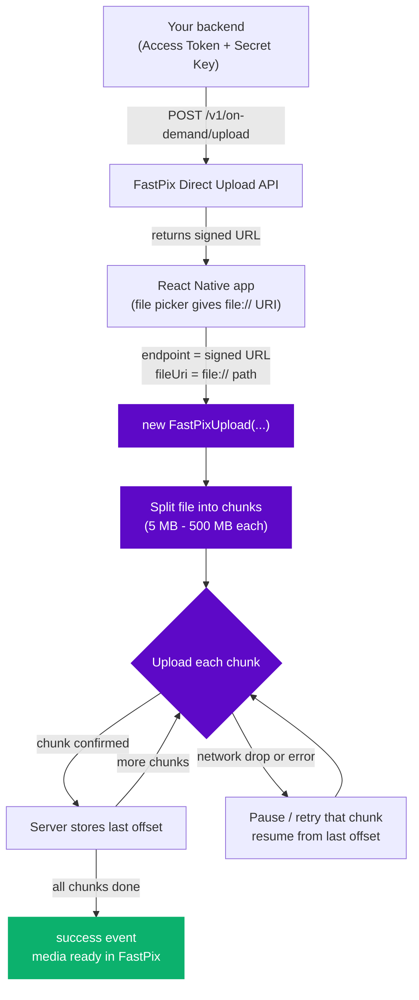

# FastPix React Native Uploads SDK - resumable, chunked video and file uploads for iOS and Android

[](https://www.npmjs.com/package/@fastpix/react-native-uploads)
[](https://www.npmjs.com/package/@fastpix/react-native-uploads)
[](https://github.com/FastPix/react-native-uploader/blob/main/LICENSE)
[](https://github.com/FastPix/react-native-uploader)
[](https://www.typescriptlang.org/)

The **FastPix React Native Uploads SDK** (`@fastpix/react-native-uploads`) provides reliable, resumable, high-performance uploads for large videos and files in React Native apps. It handles chunked uploads, automatic per-chunk retries, pause and resume, network recovery, and real-time progress tracking on both Android and iOS.

**Works with:** React Native 0.70+ · iOS 13+ · Android 5.0+ (API 21) · TypeScript · any file picker (`file://` URIs)

📖 **Docs:** https://fastpix.com/docs/upload-videos/upload-videos-from-device &nbsp;·&nbsp; 📦 **npm:** https://www.npmjs.com/package/@fastpix/react-native-uploads &nbsp;·&nbsp; 🚀 **Dashboard:** https://dashboard.fastpix.com

> Note that this SDK is designed to work only with **FastPix** and is not a general-purpose uploads SDK.

## Features

* **Chunked Uploads** – Upload large files in configurable chunks (5 MB–500 MB).
* **Resumable Uploads** – Pause and resume uploads without re-uploading completed chunks.
* **Network Recovery** – Automatically pause and resume uploads when connectivity changes.
* **Real-time Progress** – Track upload progress with smooth, continuous updates.
* **Automatic Retries** – Recover from temporary failures with configurable exponential backoff.
* **File Size Validation** – Optionally enforce a maximum file size before uploading.
* **Flexible File URI Support** – Accepts `file://` URIs and plain filesystem paths, with automatic URL-decoding of percent-encoded paths.
* **Lifecycle Events** – Listen to upload progress, state changes, and completion events.

<br />

## Start here

If you are using the FastPix React Native Uploads SDK for the first time, follow these steps in order:

1. [Check your environment](#check-your-environment)
2. [Install the SDK](#install-the-sdk)
3. [Generate a signed upload URL](#generate-a-signed-upload-url)
4. [Upload your first file](#upload-your-first-file)
5. [Verify your upload](#verify-your-upload)
6. [Understand the upload workflow](#understand-the-upload-workflow)

Do not skip the verification steps. If an environment, install, or signed-URL problem occurs, fix it before continuing.

<br />

### Before you begin

To use the SDK, make sure you have:

- Node.js 18 or later.
- A React Native app (0.70+); if you do not have one, [Install the SDK](#install-the-sdk) shows how to create it.
- iOS: Xcode and CocoaPods (macOS), plus an iOS Simulator or a physical iPhone (iOS 13+).
- Android: JDK 17 and Android Studio (SDK and an emulator), or a physical Android device (Android 5.0 / API 21+).
- A FastPix account, with an Access Token and a Secret Key.
- A video or file to upload, available as a `file://` URI (typically from a media picker).

#### Platform Support

| Platform     | Minimum version    |
| ------------ | ------------------ |
| Android      | API 21 (Android 5.0) |
| iOS          | iOS 13.0           |
| React Native | 0.70+              |

FastPix uploads use a **signed URL**: your Access Token and Secret Key stay on your backend and are never shipped in the app. You generate a short-lived signed URL on your server (see [Generate a signed upload URL](#generate-a-signed-upload-url)) and hand only that URL to the SDK.

> **Security:** Never ship your Access Token or Secret Key in the app bundle. Generate signed URLs from your backend and return only the signed URL to the client.

<br />

## Check your environment

React Native needs Node plus a native build toolchain, not a single runtime. Check Node first:

```bash
node --version
```

The output should be `v18` or later. Then run the React Native environment doctor, which checks Xcode, CocoaPods, the JDK, the Android SDK, and available simulators and emulators in one pass:

```bash
npx react-native doctor
```

Fix anything it flags before you install the SDK. For a full walkthrough, see the React Native [environment setup guide](https://reactnative.dev/docs/set-up-your-environment).

<br />

## Install the SDK

If you do not have a React Native app yet, create one first:

```bash
npx @react-native-community/cli@latest init FastPixUploaderDemo
cd FastPixUploaderDemo
```

Then install the SDK using npm or your preferred package manager:

```bash
npm install @fastpix/react-native-uploads
```

The SDK bundles its runtime dependencies (`@react-native-community/netinfo`, `react-native-blob-util`, and `axios`), so there are no peer dependencies to install manually.

### iOS — install native pods

The bundled native modules auto-link on React Native 0.70+. After installing the package, run:

```bash
cd ios && pod install && cd ..
```

**Android:** No manual linking or extra setup is required — the native modules auto-link.

<br />

## Generate a signed upload URL

To get started with the SDK, you will need a signed URL.

To make API requests, you'll need a valid **Access Token** and **Secret Key**. See the [Basic Authentication Guide](https://fastpix.com/docs/getting-started/activate-your-account) for details on retrieving these credentials.

Once you have your credentials, use the [Upload media from device](https://fastpix.com/docs/video-on-demand-api/upload-and-import-videos/direct-upload-video-media) API to generate a signed URL for uploading media.

<br />

### What is a Signed URL?

A signed URL is a pre-authenticated URL that allows secure, direct uploads to FastPix storage without exposing your **Access Token** and **Secret Key** inside your mobile app. You create the URL on a trusted server (or a short-lived backend call), then hand only that URL to the SDK on the device.

> **Never ship your `Access Token` / `Secret Key` in the app bundle.** Generate signed URLs from your backend and return only the signed URL to the client.

<br />

### Sample Code: Generating a Signed URL

Here is a self-contained service that calls the FastPix Direct Upload API and returns a signed URL. It uses `axios` and `base-64` for the Basic Auth header (the same approach used by the bundled example app in [`test-example/src/Services/ApiService.ts`](test-example/src/Services/ApiService.ts)):

> This is **your** backend/service code, not part of the SDK. Install its helpers with `npm install axios base-64`. On a Node backend you can drop `base-64` and use `Buffer.from(...).toString("base64")` instead.

```javascript
import axios from "axios";
import base64 from "base-64";

const TOKEN_ID = "your_token_id";
const SECRET_KEY = "your_secret_key";
const API_BASE_URL = "https://api.fastpix.io/v1/on-demand";

export async function generateSignedUrl(metadata = { uploadedBy: "react_native_app" }) {
  const auth = `Basic ${base64.encode(`${TOKEN_ID}:${SECRET_KEY}`)}`;

  const body = {
    corsOrigin: "*",
    pushMediaSettings: {
      metadata,
      accessPolicy: "public",
      maxResolution: "1080p",
    },
  };

  const response = await axios.post(`${API_BASE_URL}/upload`, body, {
    headers: {
      "Content-Type": "application/json",
      Accept: "application/json",
      Authorization: auth,
    },
  });

  const data = response.data?.data;
  if (!data?.url || !data?.uploadId) {
    throw new Error("Failed to generate signed URL");
  }

  // { url, uploadId } — pass `url` to FastPixUpload; keep `uploadId` for tracking
  return { url: data.url, uploadId: data.uploadId };
}
```

> **Endpoint note:** FastPix is migrating API hosts from `.io` to `.com`. The `api.fastpix.io` host above still works for backward compatibility, but new integrations should prefer `https://api.fastpix.com/v1/on-demand`.

<br />

### Integration: create a Signed URL, then Upload

Because `endpoint` accepts an **async factory** (`() => Promise<string>`), you can plug the signed-URL generator straight in. The async factory runs once when `start()` is called, so the URL is created lazily and stays fresh:

```javascript
import { FastPixUpload } from "@fastpix/react-native-uploads";
import { generateSignedUrl } from "./services/SignedUrlService";

export async function uploadVideo(fileUri) {
  const upload = new FastPixUpload({
    // Factory is invoked at start() — the token stays on your backend.
    endpoint: async () => {
      const { url } = await generateSignedUrl({
        uploadedBy: "react_native_app",
        fileType: "video",
      });
      return url;
    },
    fileUri, // file:// URI from your image/video picker
    chunkSize: 16 * 1024, // 16 MB chunks
    maxRetries: 3, // retry each failed chunk up to 3 times
    retryDelay: 2000, // 2s initial delay, doubling each retry
    maxFileSize: 2 * 1024 * 1024, // 2 GB limit (in KB); 0 = no limit
    enableLogs: __DEV__, // logs in development only
  });

  upload.on("progress", ({ percentage }) => console.log(`${percentage}%`));
  upload.on("success", () => console.log("Upload complete!"));
  upload.on("error", ({ message }) => console.error(message));

  await upload.start();
  return upload; // keep the ref to pause() / resume() / abort()
}
```

This example uses every constructor option — see [Configuration Parameters](#configuration-parameters) for the full table with types, defaults, and constraints.

<br />

## Upload your first file

```javascript
import { FastPixUpload } from "@fastpix/react-native-uploads";

const upload = new FastPixUpload({
  endpoint: "https://storage.googleapis.com/...your-signed-url...", // Replace with the signed URL.
  fileUri: asset.uri, // file:// URI from your image picker.
  chunkSize: 5 * 1024, // Minimum allowed chunk size is 5120KB (5MB).

  // Additional optional parameters can be specified here as needed
});

await upload.start();
```

**Parameters used above:** `endpoint`, `fileUri`, `chunkSize` — see [Configuration Parameters](#configuration-parameters) for types, defaults, and constraints.

<br />

### Verify your upload

Run the app and start an upload. Your integration is working when:

- The `progress` event advances and reaches 100%, and the `success` event fires (see [Lifecycle Events Reference](#lifecycle-events-reference)).
- The uploaded media appears in your [FastPix Dashboard](https://dashboard.fastpix.com/).

Keep the `uploadId` returned when you generated the signed URL for tracking. If the upload never starts or fails, see [Troubleshooting](#troubleshooting).

<br />

## Understand the upload workflow

Your backend creates a short-lived signed URL (so your Access Token and Secret Key never ship in the app); the SDK then uploads the file to that URL in resumable chunks and confirms each chunk's offset with the server, so any pause or network drop continues from where it left off.



<br />

## Next steps

After your first upload works, use the SDK to:

- Pause, resume, and recover from network drops - see [Resumable Uploads: Pause, Resume & Network Recovery](#resumable-uploads-pause-resume--network-recovery).
- Track retries per chunk - see [Chunk-Level Retry Tracking](#chunk-level-retry-tracking).
- React to upload lifecycle events - see [Lifecycle Events Reference](#lifecycle-events-reference).
- Control the upload (start, pause, resume, abort) - see [Upload Control Methods](#upload-control-methods).
- Configure chunk size, retries, file-size limits, and more - see [API Reference](#api-reference).
- Run a complete working screen - see [Example App](#example-app).

<br />

## Resumable Uploads: Pause, Resume & Network Recovery

Resumability is the core of this SDK. Every chunk that finishes uploading is acknowledged by the server, so a paused, interrupted, or network-dropped upload always continues from the **last server-confirmed offset** — completed chunks are never re-sent.

There are two ways an upload can pause:

| Trigger | How it happens | How it resumes |
| ------- | -------------- | -------------- |
| **User-initiated** | You call `upload.pause()` | You call `await upload.resume()` |
| **Network-initiated** | Connectivity is lost, or the transport switches (Wi-Fi ↔ cellular) | The SDK resumes **automatically** when connectivity returns |

Both emit a `pause` event carrying a `reason` (`'user'` or `'network'`), so your UI can react appropriately.

<br />

### Minimal pause / resume flow

```javascript
import { FastPixUpload } from "@fastpix/react-native-uploads";

const upload = new FastPixUpload({
  endpoint: "https://storage.googleapis.com/...signed-url...",
  fileUri: asset.uri,
  chunkSize: 16 * 1024, // 16 MB chunks
  maxRetries: 3,
});

upload.on("progress", ({ percentage }) => console.log(`${percentage}%`));
upload.on("pause", ({ reason }) => console.log(`Paused (${reason})`));
upload.on("resume", ({ fromOffset }) => console.log(`Resumed from byte ${fromOffset}`));
upload.on("success", () => console.log("Upload complete!"));

await upload.start();

// …later, from a button press:
upload.pause();            // pauses immediately, preserving progress
await upload.resume();     // re-syncs the server offset, then continues
```

**Parameters used above:** `endpoint`, `fileUri`, `chunkSize`, `maxRetries` — see [Configuration Parameters](#configuration-parameters) for types, defaults, and constraints.

<br />

### Full React component: progress bar with pause / resume / abort

A complete, copy-paste example wiring the resumable lifecycle to UI controls. The same flow is implemented end-to-end in the bundled [`test-example/`](test-example/) app.

```jsx
import React, { useEffect, useRef, useState } from "react";
import { View, Text, Button, ActivityIndicator } from "react-native";
import { FastPixUpload } from "@fastpix/react-native-uploads";
import { generateSignedUrl } from "./services/SignedUrlService";

export function VideoUploader({ fileUri }) {
  const uploadRef = useRef(null);
  const [percentage, setPercentage] = useState(0);
  const [state, setState] = useState("IDLE");

  useEffect(() => {
    const upload = new FastPixUpload({
      endpoint: async () => (await generateSignedUrl()).url, // created lazily at start()
      fileUri,
      chunkSize: 16 * 1024, // 16 MB chunks
      maxRetries: 3,
      retryDelay: 2000,
      enableLogs: __DEV__,
    });
    uploadRef.current = upload;

    // on() returns an unsubscribe function — collect and clean up on unmount.
    const off = [
      upload.on("progress", ({ percentage }) => setPercentage(percentage)),
      upload.on("stateChange", ({ to }) => setState(to)),
      upload.on("pause", ({ reason }) =>
        console.log(reason === "network" ? "Paused — waiting for network…" : "Paused by user"),
      ),
      upload.on("resume", ({ fromOffset }) => console.log(`Resumed from ${fromOffset}`)),
      upload.on("success", () => console.log("Upload complete!")),
      upload.on("error", ({ message }) => console.error(message)),
    ];

    upload.start();

    return () => {
      off.forEach((unsubscribe) => unsubscribe());
      upload.abort(); // release native resources if the screen unmounts mid-upload
    };
  }, [fileUri]);

  const isUploading = state === "UPLOADING" || state === "RESUMED";
  const isPaused = state === "PAUSED";

  return (
    <View style={{ padding: 16, gap: 12 }}>
      <Text>{state} — {percentage}%</Text>
      {isUploading && <ActivityIndicator />}

      <Button title="Pause"  onPress={() => uploadRef.current?.pause()}  disabled={!isUploading} />
      <Button title="Resume" onPress={() => uploadRef.current?.resume()} disabled={!isPaused} />
      <Button title="Abort"  onPress={() => uploadRef.current?.abort()}  disabled={state === "IDLE"} />
    </View>
  );
}
```

**Parameters used above:** `endpoint`, `fileUri`, `chunkSize`, `maxRetries`, `retryDelay`, `enableLogs` — see [Configuration Parameters](#configuration-parameters) for types, defaults, and constraints.

<br />

### Automatic network recovery

The SDK automatically resumes uploads when network connectivity is restored. While an upload is in flight the SDK monitors connectivity via `@react-native-community/netinfo`:

* **Goes offline** → the upload pauses and emits `pause` with `reason: 'network'` (plus an `offline` event).
* **Comes back online** → the upload resumes automatically from the last confirmed offset (emitting `online`, then `resume`).
* **Transport switches** (Wi-Fi ↔ cellular) while a socket is mid-flight → the SDK detects the dead connection, re-syncs the server offset, and continues — no stalled upload, no manual retry.

An upload paused by you (`reason: 'user'`) is **not** auto-resumed on reconnect — that stays under your control, so a user-paused upload never restarts behind their back.

<br />

## Chunk-Level Retry Tracking

Retries are tracked **per individual chunk** rather than with a single global counter. Each chunk gets its own budget of `maxRetries` attempts with exponential back-off, so one flaky chunk can never exhaust the retry allowance of the others.

**Benefits**

* **No app sluggishness** – a single problematic chunk is isolated and doesn't stall the rest of the upload.
* **Better error isolation** – a failed chunk never affects the retry limits of chunks that already succeeded.
* **Precise recovery** – on a network blip only the in-flight chunk retries; completed chunks are never re-uploaded.

You can observe this live through the chunk events:

```javascript
upload.on("chunkAttempt", ({ chunkIndex, attemptNumber, totalChunkNumbers }) => {
  console.log(`Chunk ${chunkIndex}/${totalChunkNumbers} — attempt ${attemptNumber}`);
});

upload.on("chunkAttemptFailure", ({ chunkIndex, attemptNumber, error }) => {
  console.warn(`Chunk ${chunkIndex} failed (attempt ${attemptNumber}/${/* maxRetries */ 5}): ${error.message}`);
});

upload.on("chunkSuccess", ({ chunkIndex }) => {
  console.log(`Chunk ${chunkIndex} uploaded`);
});
```

<br />

## Lifecycle Events Reference

Subscribe to upload lifecycle events using `upload.on(event, handler)`. Each subscription returns a cleanup function, making it easy to use with React's `useEffect`.

```javascript
// Upload started
upload.on("started", ({ fileSize, endpoint }) => {
  console.log(`Upload started (${fileSize} bytes) → ${endpoint}`);
});

// Upload progress
upload.on("progress", ({ percentage, bytesUploaded, bytesTotal }) => {
  console.log(`${percentage}% (${bytesUploaded}/${bytesTotal})`);
});

// Upload state changes
upload.on("stateChange", ({ from, to }) => {
  console.log(`${from} → ${to}`);
});

// Chunk lifecycle
upload.on("chunkAttempt", ({ chunkIndex, attemptNumber, totalChunkNumbers }) => {
  console.log(`Chunk ${chunkIndex}/${totalChunkNumbers} - Attempt ${attemptNumber}`);
});

upload.on("chunkAttemptFailure", ({ chunkIndex, attemptNumber, error }) => {
  console.warn(`Chunk ${chunkIndex} failed (Attempt ${attemptNumber}): ${error.message}`);
});

upload.on("chunkSuccess", ({ chunkIndex, offset }) => {
  console.log(`Chunk ${chunkIndex} uploaded (server offset now ${offset})`);
});

// Upload completed
upload.on("success", () => {
  console.log("Upload completed successfully");
});

// Upload failed
upload.on("error", ({ message, code, retriable }) => {
  console.error(`${message}${code ? ` [${code}]` : ""} (retriable: ${retriable})`);
});

// Upload paused/resumed
upload.on("pause", ({ reason }) => {
  console.log(`Paused: ${reason}`);
});

upload.on("resume", ({ fromOffset }) => {
  console.log(`Resumed from offset ${fromOffset}`);
});

// Upload aborted
upload.on("abort", () => {
  console.log("Upload aborted");
});

// Network status
upload.on("offline", () => {
  console.log("Network offline");
});

upload.on("online", () => {
  console.log("Network online");
});
```

<br />

### Supported Events

| Event                 | Description                                                  |
| --------------------- | ------------------------------------------------------------ |
| `started`             | Fired when the upload starts.                                |
| `progress`            | Reports upload progress, uploaded bytes, and total bytes.    |
| `stateChange`         | Fired whenever the upload state changes.                     |
| `chunkAttempt`        | Fired before each chunk upload attempt.                      |
| `chunkAttemptFailure` | Fired when a chunk upload attempt fails and will be retried. |
| `chunkSuccess`        | Fired after a chunk is uploaded successfully.                |
| `success`             | Fired when the upload completes successfully.                |
| `error`               | Fired when the upload fails with a non-recoverable error.    |
| `pause`               | Fired when the upload is paused.                             |
| `resume`              | Fired when the upload resumes.                               |
| `abort`               | Fired when the upload is cancelled.                          |
| `offline`             | Fired when network connectivity is lost.                     |
| `online`              | Fired when network connectivity is restored.                 |

<br />

## Upload Control Methods

You can control the upload lifecycle with the following methods:

- **Start an Upload:**

  ```javascript
  await upload.start(); // Valid only when state is IDLE
  ```

- **Pause an Upload:**

  ```javascript
  upload.pause(); // Valid only when state is UPLOADING; preserves the last acknowledged offset
  ```

- **Resume an Upload:**

  ```javascript
  await upload.resume(); // Valid only when state is PAUSED; re-syncs the server offset first
  ```

- **Abort an Upload:**

  ```javascript
  upload.abort(); // Permanently cancels and releases all resources; emits `abort` before removing listeners
  ```

<br />

## API Reference

### `FastPixUpload`

The main upload class. Construct it with the options below, then drive it with these methods, getters, and events.

### Configuration Parameters

The `FastPixUpload` constructor accepts the following parameters:

| Name                       | Type                                | Required | Description                                                                                                                                       |
| -------------------------- | ----------------------------------- | -------- | ----------------------------------------------------------------------------------------------------------------------------------------------- |
| `endpoint`                 | `string` or `() => Promise<string>` | Required | The signed FastPix upload URL, or an async factory that returns one. The factory is called once at `start()` — useful when tokens are short-lived. |
| `fileUri`                  | `string`                            | Required | Local file path from your file picker. Accepts `file://` URIs, plain paths.         |
| `chunkSize`                | `number` (in KB)                    | Optional | Size of each chunk in kilobytes. Default is `5120` KB (5 MB). **Minimum:** 5120 KB (5 MB), **Maximum:** 512000 KB (500 MB). **Must be a multiple of 256** — e.g. any `N * 1024` value is safe. |
| `maxRetries`               | `number`                            | Optional | Maximum retry attempts per failed chunk before the upload fails. Default is `5`.                                                                  |
| `retryDelay`               | `number` (in ms)                    | Optional | Initial delay before the first retry. Each subsequent retry doubles the delay (exponential back-off). Default is `1000`.                          |
| `maxFileSize`              | `number` (in KB)                 | Optional | Maximum allowed file size. `0` means no limit. Files exceeding this fail immediately before any network request. Default is `0`.                  |
| `enableLogs`               | `boolean`                           | Optional | Enable SDK-internal debug logging to the console. Recommended for development; disable in production. Default is `false`.                         |

<br />

#### Example usage of integrating all parameters

```javascript
import { FastPixUpload } from "@fastpix/react-native-uploads";

const upload = new FastPixUpload({
  endpoint: "https://storage.googleapis.com/...signed-url...", // Signed URL for uploading
  fileUri: "file://...File_Path...", // file:// URI to upload
  chunkSize: 5 * 1024, // default is 5 MB per chunk
  maxRetries: 3, // Retry each failed chunk up to 3 times
  retryDelay: 1000, // Initial 1s delay, doubling each retry
  maxFileSize: 200 * 1024, // 200 MB limit
  enableLogs: false, // Debug logs in development only
});

upload.on("started", ({ fileSize }) => console.log(`Starting ${fileSize} bytes`));
upload.on("progress", ({ percentage }) => console.log(`${percentage}%`));
upload.on("success", () => console.log("Upload complete!"));
upload.on("error", ({ message }) => console.error(message));

await upload.start();

// Control:
// upload.pause();
// await upload.resume();
// upload.abort();
```

<br />

### Methods

| Method | Signature | Description |
| ------ | --------- | ----------- |
| `start()`  | `() => Promise<void>` | Starts the upload. Valid only from the `IDLE` state; otherwise ignored with a warning. |
| `pause()`  | `() => void`          | Pauses an in-progress upload, preserving the last acknowledged offset. Valid only from `UPLOADING`. |
| `resume()` | `() => Promise<void>` | Resumes a paused upload. Re-syncs the server offset first, then continues. Valid only from `PAUSED`. |
| `abort()`  | `() => void`          | Permanently cancels the upload and releases native resources. Emits `abort`, then removes all listeners. |
| `on(event, handler)`  | `(event, handler) => () => void` | Subscribes to a [lifecycle event](#supported-events). **Returns an unsubscribe function.** |
| `off(event, handler)` | `(event, handler) => void`       | Manually removes a previously registered listener. |

<br />

### Getters

| Getter | Type | Description |
| ------ | ---- | ----------- |
| `state`        | `UploadState` | The current state of the upload state machine. |
| `progress`     | `UploadProgressSnapshot` | A point-in-time snapshot of upload progress (bytes, percentage, current chunk). |
| `stateHistory` | `ReadonlyArray<{ from, to, at }>` | An ordered log of every state transition, each with a timestamp (`at`). |

<br />

### Types

#### `UploadState`

```typescript
type UploadState =
  | "IDLE"       // Constructed, not yet started
  | "STARTED"    // start() called, preparing
  | "UPLOADING"  // Actively transferring chunks
  | "PAUSED"     // Paused (by user or network)
  | "RESUMED"    // Transitioning back into UPLOADING
  | "FAILED"     // Stopped with a non-recoverable error
  | "COMPLETED"; // All chunks uploaded successfully
```

#### `UploadProgressSnapshot`

Returned by the `progress` getter.

| Property            | Type          | Description                                      |
| ------------------- | ------------- | ------------------------------------------------ |
| `state`             | `UploadState` | Current upload state.                            |
| `bytesUploaded`     | `number`      | Bytes transferred and confirmed so far.          |
| `bytesTotal`        | `number`      | Total size of the file in bytes.                 |
| `percentage`        | `number`      | Completion percentage (0–100).                   |
| `currentChunkIndex` | `number`      | Index of the chunk currently being processed.    |

#### `ChunkMeta`

Describes the byte range of a single chunk. Exported for consumers that need to reason about chunk boundaries.

| Property    | Type     | Description                                      |
| ----------- | -------- | ------------------------------------------------ |
| `index`     | `number` | Zero-based index of the chunk.                   |
| `start`     | `number` | Start byte offset of the chunk (inclusive).      |
| `end`       | `number` | End byte offset of the chunk (exclusive).        |
| `totalSize` | `number` | Total size of the file in bytes.                 |

For the full list of event payloads, see [Supported Events](#supported-events).

<br />

## Example App

A complete React Native example application is included in the repository to help you get started quickly.

The example demonstrates:

* Selecting media from the device
* Creating an upload instance
* Tracking upload progress
* Handling upload lifecycle events
* Pause, resume, and abort operations
* Network recovery
* Error handling

Refer to the **`test-example/`** directory for the complete implementation.

<br />

## Troubleshooting

| Symptom | Likely cause | Fix |
| ------- | ------------ | --- |
| `File is empty or could not be read` | The `fileUri` points to a missing file, or a `content://` / asset URI the native layer can't `stat`. | Pass a resolved `file://` path or plain filesystem path. Copy picker/asset URIs to a local file first. |
| `File size … exceeds the maximum allowed size` | The file is larger than `maxFileSize` (in **KB**). | Increase `maxFileSize`, or set it to `0` to disable the limit. |
| `chunkSize` validation error | `chunkSize` is outside the allowed range, or not a multiple of 256. | Use a value between `5120` KB (5 MB) and `512000` KB (500 MB) **that is divisible by 256** (e.g. `16 * 1024`). |
| Upload never starts / `start() ignored` | `start()` was called while the upload was not in the `IDLE` state. | Only call `start()` from `IDLE`; use `resume()` to continue a paused upload. |
| Upload stalls after switching Wi-Fi ↔ cellular | The in-flight socket died without an offline/online event. | The SDK detects the transport switch and resumes from the server-confirmed offset automatically — no action needed. |
| iOS build fails to find native modules | Pods not installed after adding the package. | Run `cd ios && pod install`. |
| No events firing | Listeners were attached after `abort()`, which removes all listeners. | Re-attach listeners on a new `FastPixUpload` instance after an abort. |

Enable `enableLogs: true` in the constructor to see detailed SDK-internal logs while diagnosing issues (disable in production).

<br />

## Which FastPix repo do I need?

This SDK uploads from a React Native app. For other platforms and the backend piece:

| I want to... | Repo |
|---|---|
| Generate signed upload URLs from a Node backend | [node-sdk](https://github.com/FastPix/node-sdk) |
| Add resumable uploads in the browser (JS) | [web-uploads-sdk](https://github.com/FastPix/web-uploads-sdk) |
| Add a React uploader component (web) | [react-web-uploader](https://github.com/FastPix/react-web-uploader) |
| Add resumable uploads to a native iOS app | [iOS-Uploads](https://github.com/FastPix/iOS-Uploads) |
| Play the uploaded video on the web | [web-player-component](https://github.com/FastPix/web-player-component) |

Browse everything in the [FastPix organization](https://github.com/orgs/FastPix/repositories).

<br />

## FAQ

**What does this SDK do?**
It uploads large videos and files from a React Native app to FastPix in resumable chunks, with pause/resume, per-chunk retries, and automatic network recovery. See [Features](#features).

**Which package do I install?**
`npm install @fastpix/react-native-uploads`. See [Installation](#install-the-sdk).

**Do I need a signed URL? Why?**
Yes. You generate a short-lived signed URL on your backend so your Access Token and Secret Key never ship inside the app. The device only ever sees the signed URL. See [Generate a signed upload URL](#generate-a-signed-upload-url).

**Does it work with Expo?**
It ships native modules (NetInfo, blob-util), so it needs a bare/dev-client React Native build (0.70+), not Expo Go. See [Platform Support](#platform-support).

**What is the minimum and maximum chunk size?**
5 MB (5120 KB) to 500 MB (512000 KB), and the value must be a multiple of 256. See [Configuration Parameters](#configuration-parameters).

**How does resume work after a network drop?**
Each chunk's offset is confirmed by the server, so the upload continues from the last confirmed offset - completed chunks are never re-sent. Network-triggered pauses resume automatically. See [Resumable Uploads](#resumable-uploads-pause-resume--network-recovery).

**Do I need to run `pod install`?**
On iOS, yes: `cd ios && pod install`. Android auto-links with no extra steps. See [Installation](#install-the-sdk).

**Is it written in TypeScript?**
Yes - the SDK ships types, and all options, events, and getters are typed. See [API Reference](#api-reference).

<br />

## Additional References

[FastPix Homepage](https://www.fastpix.com/)
[FastPix Dashboard](https://dashboard.fastpix.com/)

## Detailed Usage

For more detailed steps and advanced usage, please refer to the official [FastPix Documentation](https://fastpix.com/docs/upload-videos/upload-videos-from-device#uploading-large-media-files).
